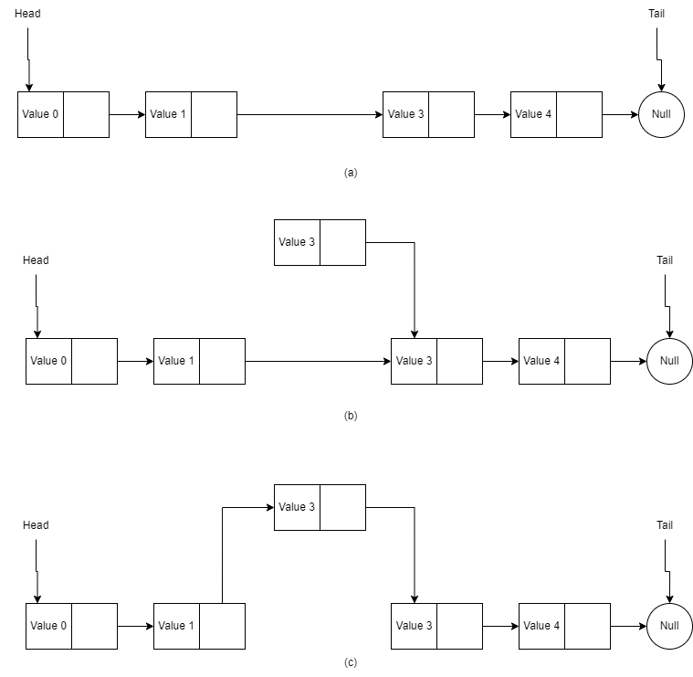

# LinkedLists

## Introduction

These notes are derived from the [Data Structures and Algorithms in Java: International Student Version 6th Edition by Goodrich, M and Tamassia, R](https://www.directtextbook.com/isbn/9781118808573).

Similar to the array data structure, linked-list data structure is a linear data structure meant to storing 
things in a particular order. Arrays however have a few drawbacks, mainly:

- The capacity of an array is fixed when it's created.
- Insertion & deletions at interior positions of the array can be time-consuming &  if many elements need to be shifted.

A linked list resolves these issues through the use of nodes, where each node is connected to the next node.

## Node

A node in linked list serves 2 functions:

- **Store the value.** Similar to the array data structure, a linked list also stores multiple values (the way it stores the values in memory
  is different though). Since a linked list is made up of nodes, the linked list therefore stores the values.
- **Store a reference to the next node.** By storing the reference to the next node, we can travers all the nodes in the linked list by pointer hopping. 

## Linked List

As discussed in the previous section, a linked list is made up of nodes. The linked list will keep a reference to the **head node** 
(head node is the first node in the linked list). Without a reference to the head, there would be no way to locate the head node and 
all the nodes that follow it.

Another option is to keep a reference to the **tail node**(the last node in the list). The tail node is identified by having a null
as it's next reference. Keeping a reference to this node increases efficiency because you would not need to perform link-hopping to 
get to the tail node.

Another optional attribute of a linked list, is to keep count of all the nodes in the list, this way, there is no need to traverse the 
list and count each traversal.

### Insertions

#### Inserting New Head Node

a) The linked list before insertion takes place.
b) Create a new node and set its `next` reference to the linked list's head node.
c) Set the linked list's `head` reference to the new node.

#### Inserting New Tail

In order to insert a new tail, we need the reference of the tail node. This can be achieved either by link hopping until the last node is 
reach or the keeping a reference to the tail node.

a) The linked list before insertion takes place.
b) Create a new node and make its `next` reference `null`.
c) Set the linked list's `tail` reference to `next` &  set the `tail` to the new node.

#### Inserting in Interior of List

Textbook does not provide any information to inserting a node in the interior of the linked list, but I came up with a little something.

Let's assume we want to insert a node at index `n`. In order to do that, we need to perform link hopping to get node at position `n-1`, 
let's call this `preNode`.

a) The linked list before insertion takes place.
b) Create a new node with its `next` reference set to `preNode`'s next reference.
c) Set `preNode`'s next reference to the new node.

### Deletions

#### Deleting Head Node

#### Deleting Tail

#### Deleting Node in Interior of List

## UML

## Tests